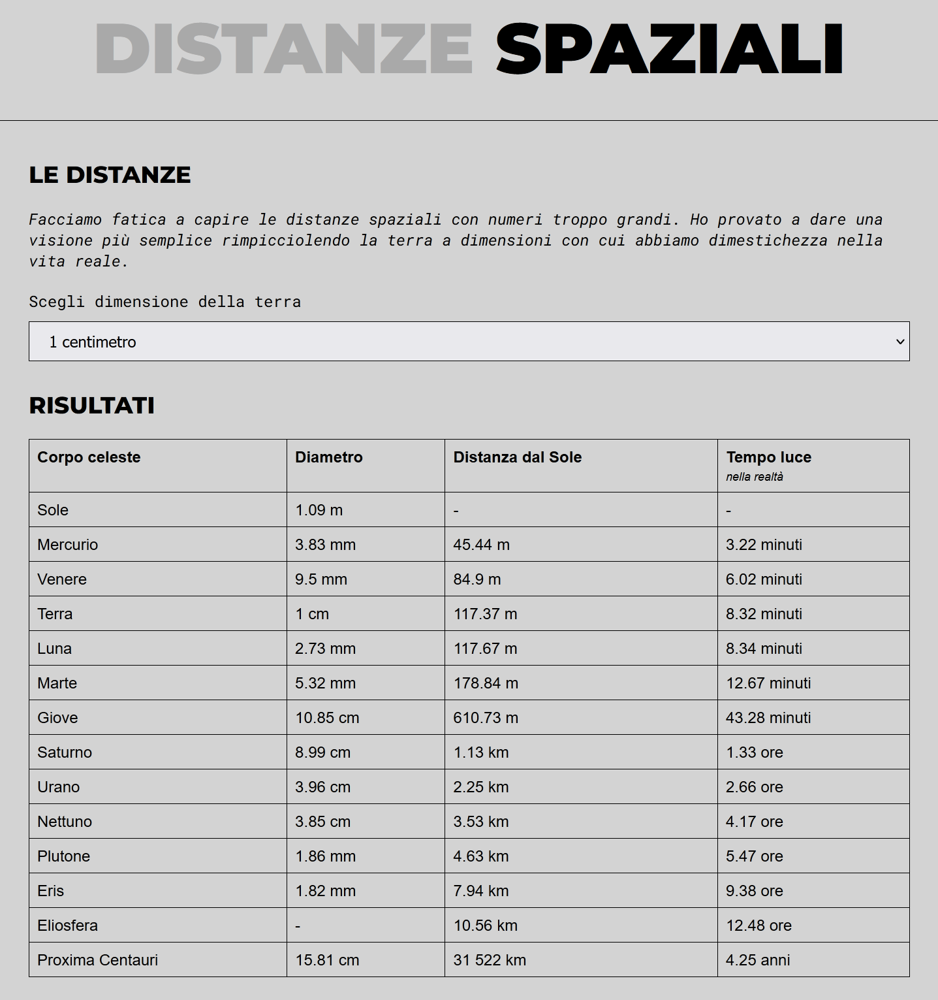
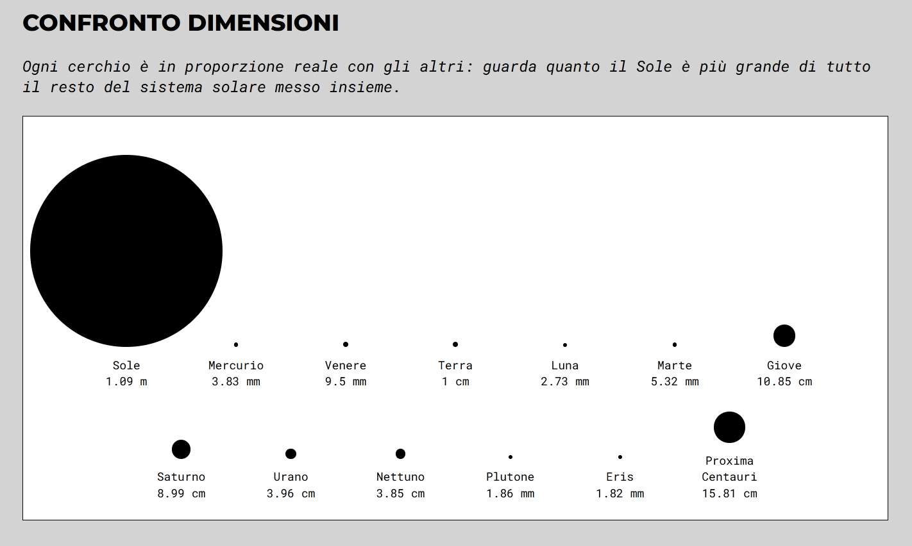

# Distanze Spaziali

Una piccola web app che aiuta a capire quanto sono immense le distanze nello spazio, rimpicciolendo la Terra a una dimensione familiare (un atomo, un capello, un millimetro, un chilometro...) e ricalcolando in proporzione i diametri e le distanze di tutti gli altri corpi del sistema solare, fino a Proxima Centauri.

## Demo

[Su GitHub Pages](https://archistico.github.io/DistanzeSpaziali/)

## Screenshot

<!-- Sostituisci questi due placeholder con degli screenshot reali del sito, salvati in una cartella `screenshots/` nella root del progetto. -->

*La tabella con diametri, distanze dal Sole e tempo che la luce impiega davvero a percorrerle.*

*Il confronto visivo tra i diametri reali dei corpi celesti, dal Sole a Proxima Centauri.*

## Come funziona

Si sceglie a cosa rimpicciolire il diametro della Terra (un atomo, un capello, 1 mm, 1 cm, 10 cm, 1 m, 1 km, o la Terra vera e propria). La pagina ricalcola automaticamente, con lo stesso fattore di scala, il diametro e la distanza dal Sole di: Sole, Mercurio, Venere, Terra, Luna, Marte, Giove, Saturno, Urano, Nettuno, Plutone, Eris, l'eliosfera e Proxima Centauri.

Oltre alla tabella, la sezione "Confronto dimensioni" mostra i diametri come cerchi in scala reale tra loro, per rendere immediatamente visibile quanto il Sole domini il resto del sistema solare. La colonna "Tempo luce" mostra invece un dato indipendente dalla scala scelta: quanto tempo impiega davvero la luce a percorrere quella distanza nello spazio reale (es. 4,25 anni per raggiungere Proxima Centauri).

## Tecnologie

HTML, CSS e JavaScript "vanilla", senza framework né passaggi di build. Font da Google Fonts (Roboto Mono, Montserrat).

## Uso in locale

Basta aprire `index.html` in un browser: non serve alcuna installazione o server.

## Autore

2022 © Emilie Rollandin — info🐌supercat.dev
